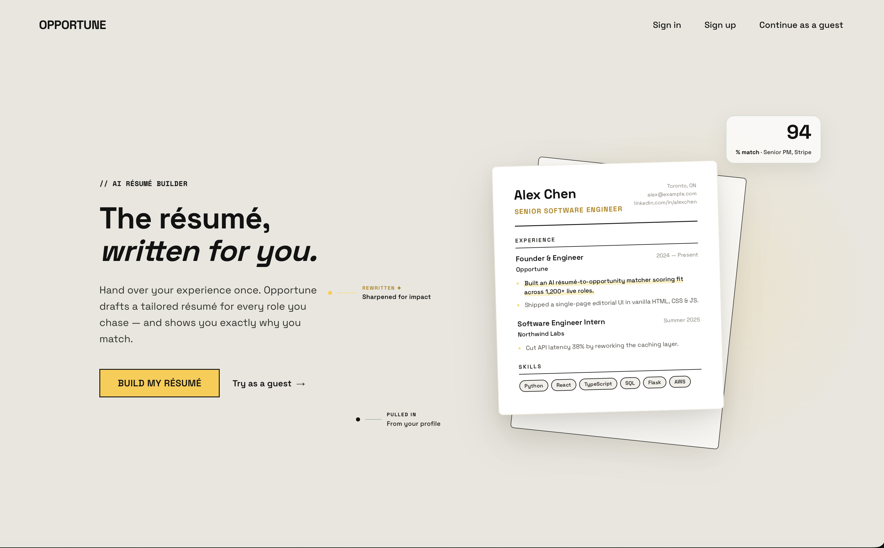
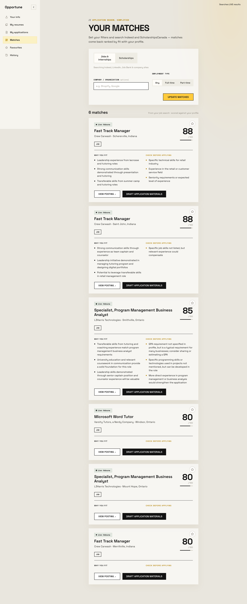
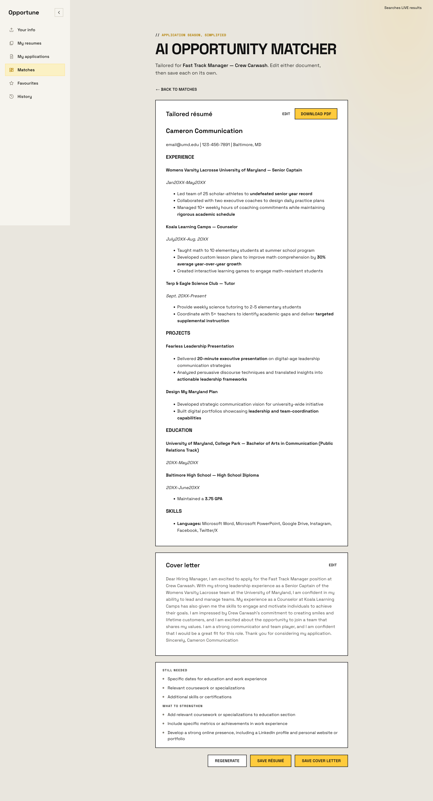

# Opportune

**AI-powered resume & opportunity matcher.** Upload your resume, get matched to
jobs and scholarships with an AI-scored fit rating, then generate a tailored
resume and cover letter as a polished PDF — all running on free API tiers, with
no paid LLM key required.

🔗 **Live demo:** https://opportune-o4lb.onrender.com

> Hosted on Render's free tier, so the first request after it's been idle can
> take ~30–50s to wake the server — after that it's instant.



## What it does

1. **Parse** — Upload a resume PDF; `pdfplumber` pulls the text and an LLM
   structures it into a profile (skills, experience, education). No resume? Fill
   out a short form instead.
2. **Match** — Every opportunity is scored for fit by a lightweight LLM, and the
   top matches are returned with a reasoned score.
3. **Search live** — Pulls real, current jobs and scholarships from the web
   (Tavily / Adzuna) so results aren't limited to a static seed list.
4. **Generate** — Drafts a tailored resume and cover letter for a chosen
   opportunity and compiles the resume to a real PDF via the Tectonic LaTeX
   engine.

Profiles, saved resumes, and application history are persisted per user, so
returning visitors pick up where they left off.

## Screenshots

| Matched opportunities, scored by fit | Generated résumé & cover letter |
|---|---|
|  |  |

## Tech stack

- **Backend:** Python · Flask · SQLAlchemy (SQLite locally, Postgres in prod)
- **Frontend:** React (JSX), zero-build — compiled in-browser via Babel Standalone\*
- **LLM inference:** [Groq](https://console.groq.com) (free, fast,
  OpenAI-compatible); any OpenAI-compatible endpoint works via `LLM_BASE_URL` /
  `LLM_MODEL`
- **Live web search:** [Tavily](https://app.tavily.com), with Adzuna (jobs) and
  [Hack Club Search](https://search.hackclub.com) as fallbacks
- **PDF generation:** [Tectonic](https://tectonic-typesetting.github.io/) (LaTeX)
- **Hosting:** Render (free tier), served with `gunicorn`

<sub>\*In-browser Babel keeps the project zero-build for a hackathon demo. A
production build would precompile the JSX with a bundler such as Vite.</sub>

## Quick start

```bash
python3 -m venv venv
source venv/bin/activate
pip install -r requirements.txt
cp .env.example .env   # then add your GROQ_API_KEY (and optionally search/Adzuna keys)
python app.py          # tables are created and opportunities are seeded automatically on startup
```

Server runs on http://localhost:5000

Get a free Groq key at https://console.groq.com. The default models are
`llama-3.3-70b-versatile` (drafting) and `llama-3.1-8b-instant` (scoring);
override them with `LLM_MODEL` / `LLM_SCORING_MODEL`, or point at another
provider entirely with `LLM_BASE_URL`.

You can also run with **no keys at all** by setting `MOCK_MODE=true` — every
service then returns cached demo responses, useful for a stable showcase demo.

## Deployment

The [live demo](https://opportune-o4lb.onrender.com) runs on Render's free tier,
deployed automatically from the included `render.yaml` blueprint (free web
service, `gunicorn app:app`, and a build step that installs deps plus the
Tectonic LaTeX engine). API keys are set as environment variables in the Render
dashboard, never committed. Tables are created and opportunities seeded on
startup; add a Render Postgres for persistence, otherwise it uses ephemeral
SQLite. To run your own copy, fork the repo and point a new Render Blueprint at
it.

## API

Core pipeline:

| Method | Path | Purpose |
|--------|------|---------|
| GET | `/health` | Sanity check |
| POST | `/upload-resume` | Upload PDF → structured profile |
| POST | `/build-profile-from-form` | Manual profile entry fallback |
| POST | `/match-opportunities` | Score & rank the top matching opportunities |
| POST | `/search-live-opportunities` | Live web search for jobs / scholarships |
| POST | `/generate-application` | Generate a tailored resume + cover letter |
| POST | `/render-resume-pdf` | Compile the tailored resume to a PDF |

Additional routes handle email-based login, saved profiles/resumes, and
application history (see `app.py`).
